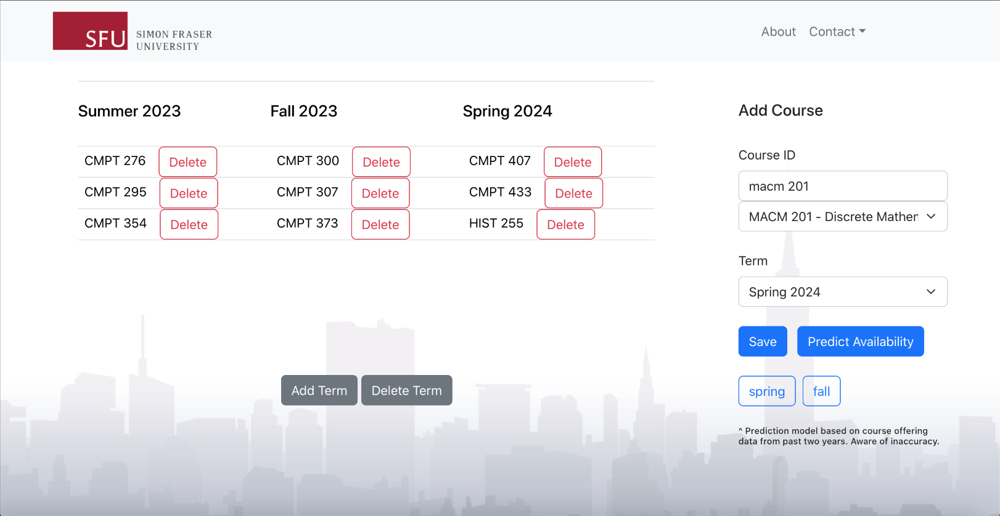
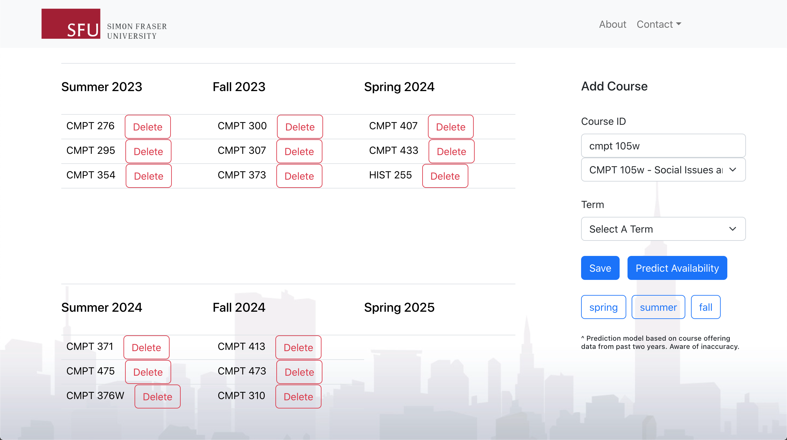

# SFU-Course-Planner

An advanced course planner web application that enables SFU students to plan ahead for their future courses. Application integrates with features such as future course offerings availbility prediction by analyzing past course offering data from SFU Course Outline REST API.





# Usage

To use this template to start your own project:

## Backend Setup
      
### No virtualenv

This assumes that `python3` is linked to valid installation of python 3 and that `pip` is installed and `pip3`is valid
for installing python 3 packages.

Installing inside virtualenv is recommended, however you can start your project without virtualenv too by skipping the steps below.

Run the following command to initialize virtual environment:

    $ python3 -m venv venv
    
And then run command to activate virtual environment:

    $ . venv/bin/activate
    
### Existing virtualenv

If by now your project is already in an existing python3 virtualenv first install project dependencies by running:

    $ pip install -r requirements.txt
    
You can now run the development server:

    $ python manage.py runserver 8080
    
## Frontend Setup

Inside frontend directory, install project dependencies through the following command:

```bash
npm install
```

Then run the application by typing: 

```bash
npm start
```

Your website will be hosted on port 3000 and should automatically directs you to localhost:3000 

Have fun!
